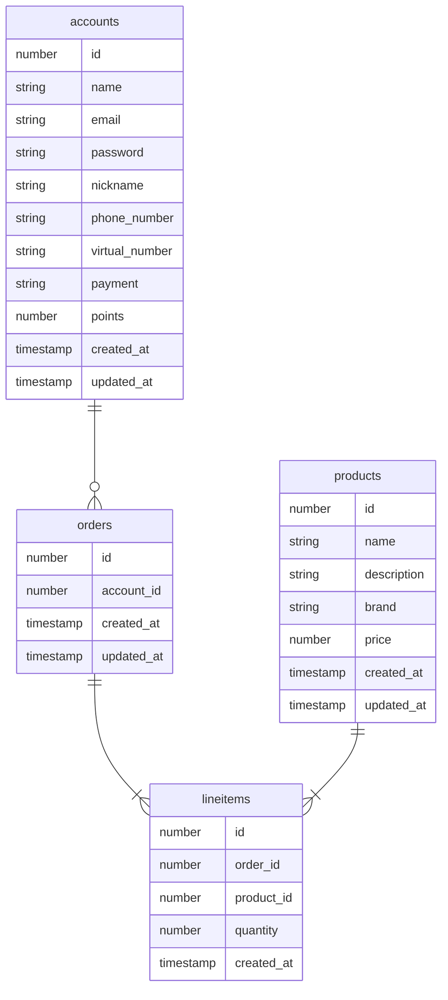

# Fake data generator for RDB

## How to run

```
mvn package
```

## Example

### ERD



### DDL

```sql
CREATE TABLE accounts
(
    id             BIGINT PRIMARY KEY,
    name           VARCHAR(255),
    email          VARCHAR(255),
    password       VARCHAR(255),
    nickname       VARCHAR(255),
    phone_number   VARCHAR(255),
    virtual_number VARCHAR(255),
    payment        VARCHAR(255),
    points         INT,
    created_at     TIMESTAMP,
    updated_at     TIMESTAMP
);

CREATE TABLE orders
(
    id         BIGINT PRIMARY KEY,
    account_id BIGINT,
    created_at TIMESTAMP,
    updated_at TIMESTAMP
);
ADD CONSTRAINT orders_account_id_fk FOREIGN KEY (account_id) REFERENCES accounts(id);

CREATE TABLE lineitems
(
    id         BIGINT PRIMARY KEY,
    order_id   BIGINT,
    product_id BIGINT,
    quantity   INT,
    created_at TIMESTAMP
);
ADD CONSTRAINT lineitems_order_id_fk FOREIGN KEY (order_id) REFERENCES orders(id);
ADD CONSTRAINT lineitems_product_id_fk FOREIGN KEY (product_id) REFERENCES products(id);


CREATE TABLE products
(
    id          BIGINT PRIMARY KEY,
    name        VARCHAR(255),
    description VARCHAR(255),
    brand       VARCHAR(255),
    price       INT,
    created_at  TIMESTAMP,
    updated_at  TIMESTAMP
);
```

### config.json

```json
{
  "sources": [
    {
      "name": "source1",
      "type": "jdbc",
      "url": "jdbc:mysql://localhost:3306/etltool",
      "user": "malachai",
      "password": "0107",
      "tables": [
        {
          "name": "accounts",
          "insertInterval": "10000",
          "update": "random",
          "updateInterval": "5000",
          "columns": [
            {
              "name": "id",
              "type": "long",
              "constraint": "primary"
            },
            {
              "name": "name",
              "type": "string",
              "kind": "name"
            },
            {
              "name": "password",
              "type": "string",
              "constraint": "final",
              "kind": "internet.password"
            },
            {
              "name": "nickname",
              "type": "string",
              "constraint": "final",
              "kind": "name"
            },
            {
              "name": "phone_number",
              "type": "string",
              "constraint": "final",
              "kind": "phone"
            },
            {
              "name": "virtual_number",
              "type": "string",
              "kind": "phone"
            },
            {
              "name": "payment",
              "type": "string",
              "kind": "business.creditCardType"
            },
            {
              "name": "points",
              "type": "long",
              "kind": "commerce.points"
            },
            {
              "name": "created_at",
              "type": "timestamp",
              "constraint": "created_at"
            },
            {
              "name": "updated_at",
              "type": "timestamp",
              "constraint": "updated_at"
            }
          ]
        },
        {
          "name": "orders",
          "insertInterval": "2000",
          "columns": [
            {
              "name": "id",
              "type": "long",
              "constraint": "primary"
            },
            {
              "name": "account_id",
              "type": "long",
              "constraint": "foreign",
              "refers": "source1.accounts.id"
            },
            {
              "name": "created_at",
              "type": "timestamp",
              "constraint": "created_at"
            },
            {
              "name": "updated_at",
              "type": "timestamp",
              "constraint": "updated_at"
            }
          ]
        },
        {
          "name": "lineitems",
          "insertInterval": "1000",
          "columns": [
            {
              "name": "id",
              "type": "long",
              "constraint": "primary"
            },
            {
              "name": "order_id",
              "type": "long",
              "constraint": "foreign",
              "refers": "source1.accounts.id"
            },
            {
              "name": "product_id",
              "type": "long",
              "constraint": "foreign",
              "refers": "source1.accounts.id"
            },
            {
              "name": "quantity",
              "type": "long",
              "kind": "number.under100"
            },
            {
              "name": "created_at",
              "type": "timestamp",
              "constraint": "created_at"
            }
          ]
        },
        {
          "name": "products",
          "insertInterval": "5000",
          "update": "random",
          "updateInterval": "2000",
          "columns": [
            {
              "name": "id",
              "type": "long",
              "constraint": "primary"
            },
            {
              "name": "name",
              "type": "string",
              "kind": "commerce.productName"
            },
            {
              "name": "description",
              "type": "string",
              "kind": "lorem.characters"
            },
            {
              "name": "brand",
              "type": "string",
              "constraint": "final",
              "kind": "commerce.department"
            },
            {
              "name": "price",
              "type": "long",
              "kind": "commerce.price"
            },
            {
              "name": "created_at",
              "type": "timestamp",
              "constraint": "created_at"
            },
            {
              "name": "updated_at",
              "type": "timestamp",
              "constraint": "updated_at"
            }
          ]
        }
      ]
    }
  ]
}
```
